[← Back to Home](./)

This module explores Intelligent Agents: software programs that understand their environment and act to achieve desired goals. Through a systematic approach, it covers individual agents and their interactions, agent-based system design, and state-of-the-art model deployment.

## Learning Outcomes

1. Identify and critically analyse agent-based systems, differentiating between architectures and approaches.
2. Apply and critically evaluate intelligent agent techniques to real-world problems, particularly where technical risk and uncertainty is involved.
3. Deploy critically appropriate software tools and skills for the design and implementation of an agent-based system, bearing in mind applicable legal, social, ethical and professional issues.
4. Systematically develop and implement the skills required to be effective member of a development team in a virtual professional environment, adopting real-life perspectives on team roles and organisation.

---

## Final Project: Multi-Agent Conceptual Drift Analyser

  <iframe width="560" height="315" src="https://www.youtube.com/embed/noT3sM0fbfc" title="Multi-Agent System Demo" frameborder="0" allow="accelerometer; autoplay; clipboard-write; encrypted-media; gyroscope; picture-in-picture" allowfullscreen></iframe>

<a href="https://github.com/julesrif/concept-genealogy">View on GitHub</a>

---

## Reflective Piece

Transitioning from deterministic data engineering to stochastic multi-agent systems introduced significant observability challenges, demanding a shift toward defensive prompt engineering tailored to each model's latent behaviour. Historical BDI models initially seemed primitive compared to modern Model Context Protocols, yet their principle of separating state from execution proved fundamental to structuring LangGraph's orchestrator-worker decoupling. Autonomous systems also expose cost predictability issues, as iterative reasoning loops inflate token consumption; ensuring reliability requires architectural safeguards, such as hybrid pipelines pairing programmatic boundaries with adversarial LLM agents from different providers.

The transition from conceptual design (Week 6) to the implemented pipeline (Week 11) exposed friction between theoretical planning and working implementation. The Unit 6 design feedback flagged our three-retry limit as lacking recovery mechanisms. Empirical testing invalidated assumptions about Semantic Scholar coverage, forcing a four-level fallback strategy. Frequent HTTP 429 errors required automated exponential delay-retry mechanisms, while the initial lack of telemetry demanded backend JSON logging. These anomalies confirmed that Human-in-the-Loop (HITL) checkpoints are mandatory architectural controls rather than regulatory add-ons.

### Case Study: Responsible Deployment

**What** - When the *openAccessPdf* was unavailable, my system extracted only the abstract and assigned a low confidence flag, which always triggered a silent Discard Reference event.

**So What** - The system truncated the investigation tree based on commercial accessibility rather than academic relevance, introducing survival bias ([Cemri et al., 2025](#ref-cemri-2025)) and a significant validity risk in scientific automation.

**Now What** - I engineered the pipeline to trigger the Elsevier Academic API as an unavoidable fallback, guaranteeing full-text extraction. Future systems will apply strict quality barriers at ingestion: halt or escalate when minimum context is unavailable, instead of propagating noise.

### Case Study: AI Safety Constraints

**What** - The Challenger agent had a bounded autonomy mechanism (Debate Retry ≤ 3), but in my initial implementation it failed to consume this budget autonomously, aborting the cycle prematurely.

**So What** - By delegating control early, the system broke the defence-in-depth model ([Du et al., 2023](#ref-du-2023)), increasing operator cognitive workload ([Mosqueira-Rey et al., 2023](#ref-mosqueira-2023)) and risking approval below the scrutiny level the system itself could reach.

**Now What** - I implemented a self-critical iteration loop where the Challenger self-executes until it exhausts its limit. Future deployments will incorporate strict state assertion tests to ensure bounded autonomy mechanisms fully exhaust their operative margins before triggering human intervention.

### Case Study: Explainable AI

**What** - I implemented an active explainability mechanism within the HITL Gates: visual breadcrumbs tracking the exact lineage from selected paper to seed paper, with step-by-step semantic evolution instead of A-Z comparison.

**So What** - A-Z comparison would be cheaper but analytically weaker. Exposing the intermediate graph turns an opaque LLM prediction into a reasoning-thread, ensuring the user's approval is well-informed human control rather than an act of faith ([Arrieta et al., 2020](#ref-arrieta-2020)).

**Now What** - Visual lineage mapping is a baseline functional requirement for any autonomous AI system. An analytical output that cannot be logically and visually tracked is a defective product from a responsible engineering standpoint.

### Emotional Response and Analysis

Our team comprised a medical doctor, a statistician, and myself as the sole software development professional, plus a fourth member who was absent from day one. I documented the absence, escalated to the tutor, and redistributed the workload.

To guarantee delivery, I deployed our collaboration infrastructure (Jira, Google Drive, WhatsApp) and chaired all twice-weekly meetings. This achieved the technical objectives but revealed the flaw in my management style of assuming direct control rather than facilitating collective ownership. The tutor's feedback validated this self-assessment. Moving forward, my focus will be on deliberate delegation, holding back to create space for collective ownership even when my instinct is to take control.

---

## Professional Skills Matrix and Action Plan

  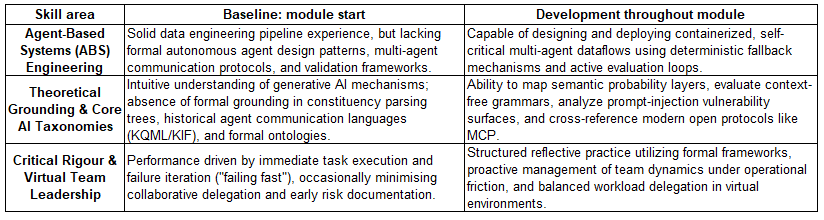

<em><strong>Table 1.</strong> Core skills development summary</em>

The most significant development occurred in Agent-Based Systems Engineering, moving from a solid data engineering baseline to a working capability for containerised, self-hosted multi-agent dataflows with deterministic fallback and active evaluation loops.

  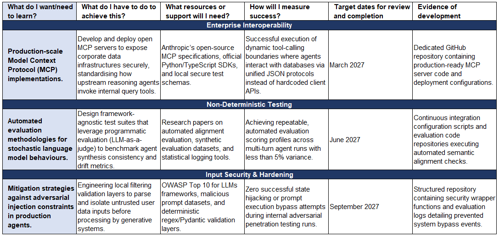

<em><strong>Table 2.</strong> Professional Development Plan</em>

Three forward targets: production-grade MCP servers (March 2027), automated LLM-as-judge evaluation with under 5% variance (June 2027), and input validation hardened against adversarial prompt injection using OWASP LLM Top 10 (September 2027).

---

## Artefacts

### Creating Agent Dialogues

KQML/KIF dialogue between two agents - Alice (procurement) and Bob (warehouse stock control):

<table>
<tr><th>Alice → Bob</th><th>Bob → Alice</th></tr>
<tr>
<td><pre>(ask-if
  :sender Alice
  :receiver Bob
  :language KIF
  :ontology logistics
  :content (available 50-inch-television)
)</pre></td>
<td><pre>(reply
  :sender Bob
  :receiver Alice
  :language KIF
  :ontology logistics
  :content (true)
)</pre></td>
</tr>
<tr>
<td><pre>(ask-one
  :sender Alice
  :receiver Bob
  :language KIF
  :ontology logistics
  :content (hdmi-slots 50-inch-television ?quantity)
)</pre></td>
<td><pre>(reply
  :sender Bob
  :receiver Alice
  :language KIF
  :ontology logistics
  :content (3)
)</pre></td>
</tr>
</table>

### Creating Parse Trees

Constituency-based parse trees demonstrating PP-attachment ambiguity:

  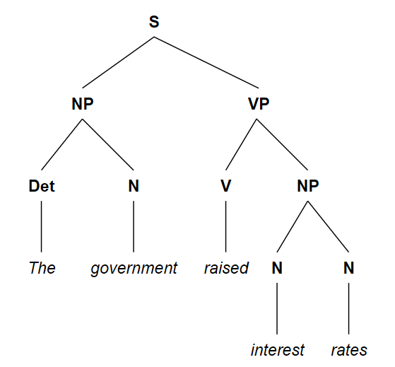

<em><strong>Figure 1.</strong> Parse Tree: "The government raised interest rates."</em>

  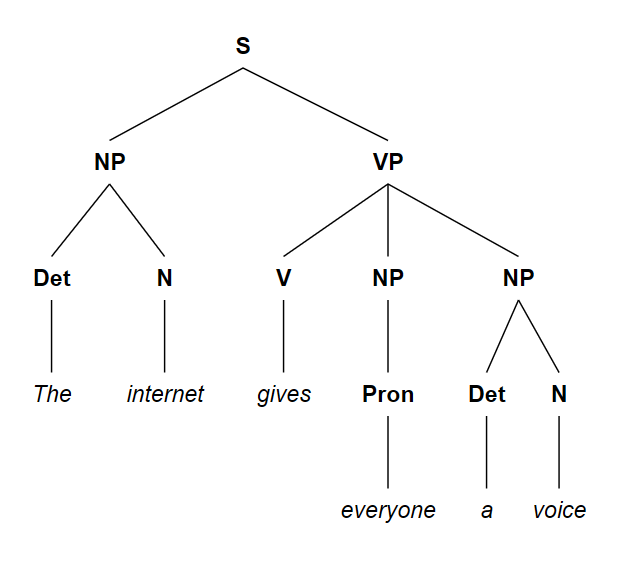

<em><strong>Figure 2.</strong> Parse Tree: "The internet gives everyone a voice."</em>

  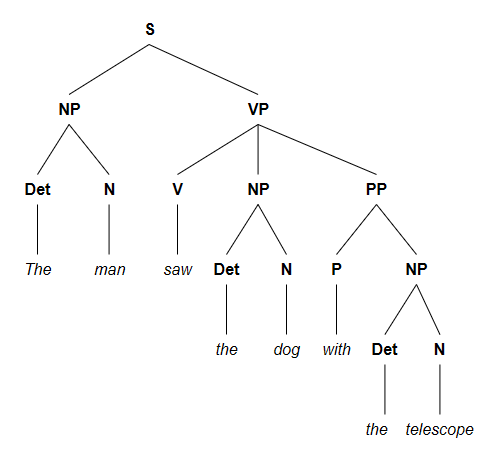

<em><strong>Figure 3.</strong> Option A: The man used the telescope to see the dog</em>

  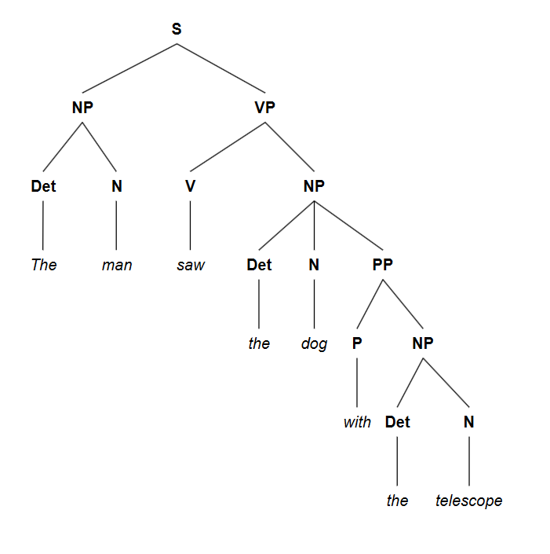

<em><strong>Figure 4.</strong> Option B: The man saw a dog that was in possession of a telescope</em>

**PP-attachment ambiguity:** The prepositional phrase 'with the telescope' can be attached to the Verb Phrase (VP), modifying the action of seeing, or to the Noun Phrase (NP), modifying the dog.

### Collaborative Discussions

Three forum discussion cycles covering agent-based systems, agent communication languages, and ethics/safety in AI. See [Appendix A](#appendix-a-discussion-forum-posts) for full posts.

### Deep Learning in Action

Socio-technical analysis of AI-driven crop protection published in the module forums. See [Appendix B](#appendix-b-deep-learning-forum-post).

---

## References

Anthropic (2024). 'Introducing the Model Context Protocol'. *Anthropic News*, 25 November. Available at: [https://www.anthropic.com/news/model-context-protocol](https://www.anthropic.com/news/model-context-protocol) (Accessed: 19 June 2026).

Arrieta, A.B., et al. (2020) 'Explainable Artificial Intelligence (XAI): Concepts, taxonomies, opportunities and challenges toward responsible AI', *Information Fusion*, 58, pp. 82–115. [doi:10.1016/j.inffus.2019.12.012](https://doi.org/10.1016/j.inffus.2019.12.012).

Cemri, M. et al. (2025) 'Why do multi-agent LLM systems fail?', *Advances in Neural Information Processing Systems (NeurIPS 2025 Datasets and Benchmarks Track)*. Available at: [https://proceedings.neurips.cc/paper_files/paper/2025/hash/b1041e52d3be19f0a9bc491657488e4a-Abstract-Datasets_and_Benchmarks_Track.html](https://proceedings.neurips.cc/paper_files/paper/2025/hash/b1041e52d3be19f0a9bc491657488e4a-Abstract-Datasets_and_Benchmarks_Track.html) (Accessed: 13 July 2026).

Du, Y. et al. (2023) 'Improving factuality and reasoning in language models through multiagent debate', in *Proceedings of the 40th International Conference on Machine Learning (ICML), PMLR 202*, pp. 8480–8501. Available at: [https://proceedings.mlr.press/v202/du23f.html](https://proceedings.mlr.press/v202/du23f.html) (Accessed: 13 July 2026).

Mosqueira-Rey, E. et al. (2023) 'Human-in-the-loop machine learning: A state of the art', *Artificial Intelligence Review*, 56, pp. 3005–3054. [doi:10.1007/s10462-022-10246-w](https://doi.org/10.1007/s10462-022-10246-w).

---

## Appendices

### Appendix A: Discussion Forum Posts

#### Discussion 1 - Agent Based Systems

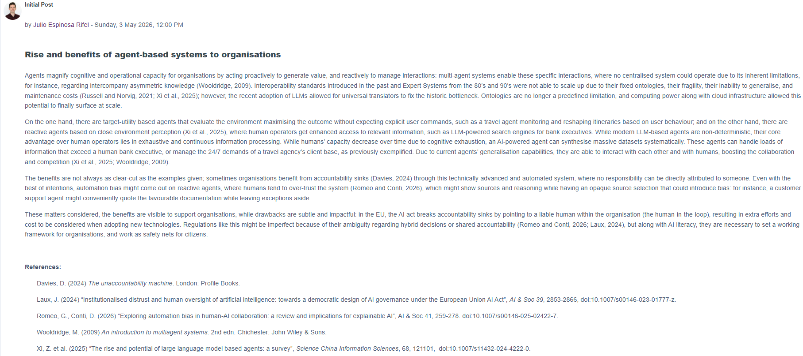

<a href="https://www.my-course.co.uk/mod/forum/discuss.php?d=364062">View Initial Post in forum</a>

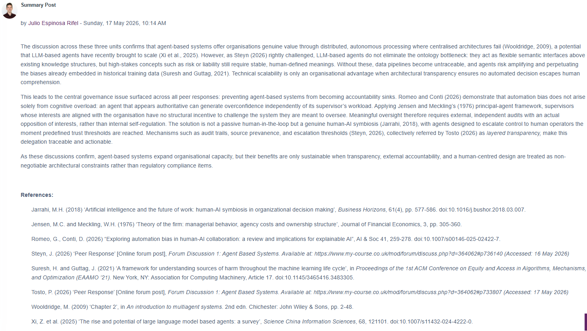

<a href="https://www.my-course.co.uk/mod/forum/discuss.php?d=366616">View Summary Post in forum</a>

#### Discussion 2 - Agent Communication Languages

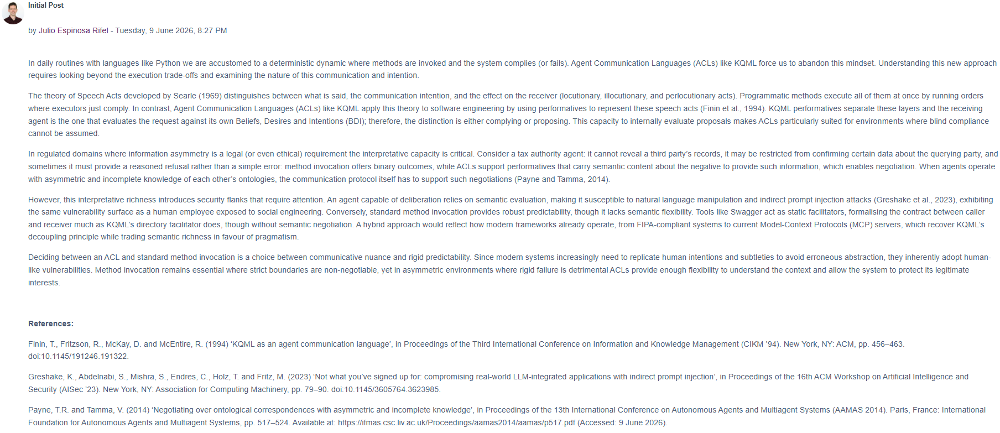

<a href="https://www.my-course.co.uk/mod/forum/discuss.php?d=370143">View Initial Post in forum</a>

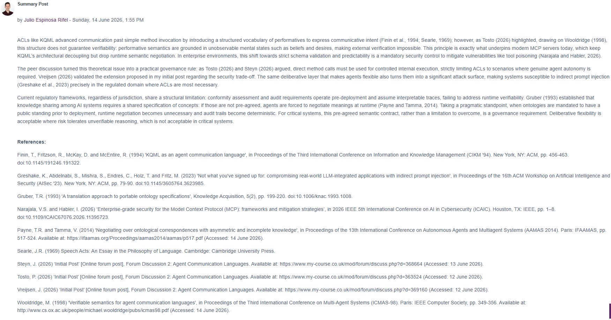

<a href="https://www.my-course.co.uk/mod/forum/discuss.php?d=370143#p748555">View Summary Post in forum</a>

#### Discussion 3 - Ethics and Safety

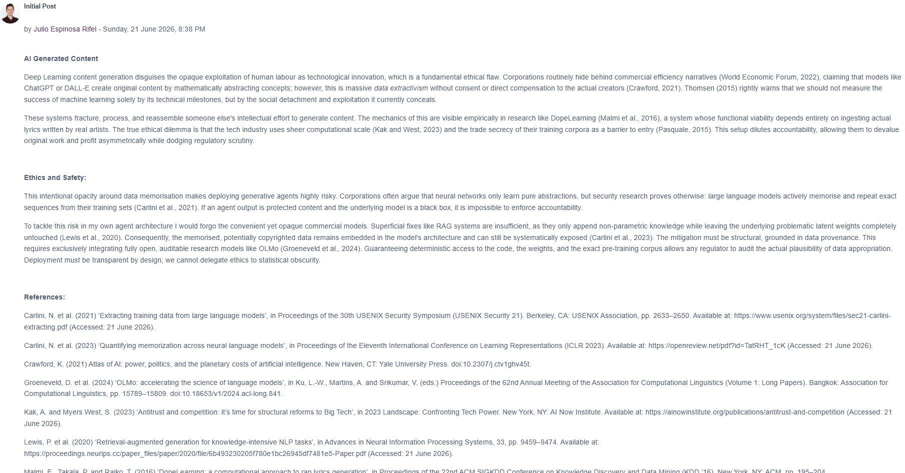

<a href="https://www.my-course.co.uk/mod/forum/discuss.php?d=372862">View Initial Post in forum</a>

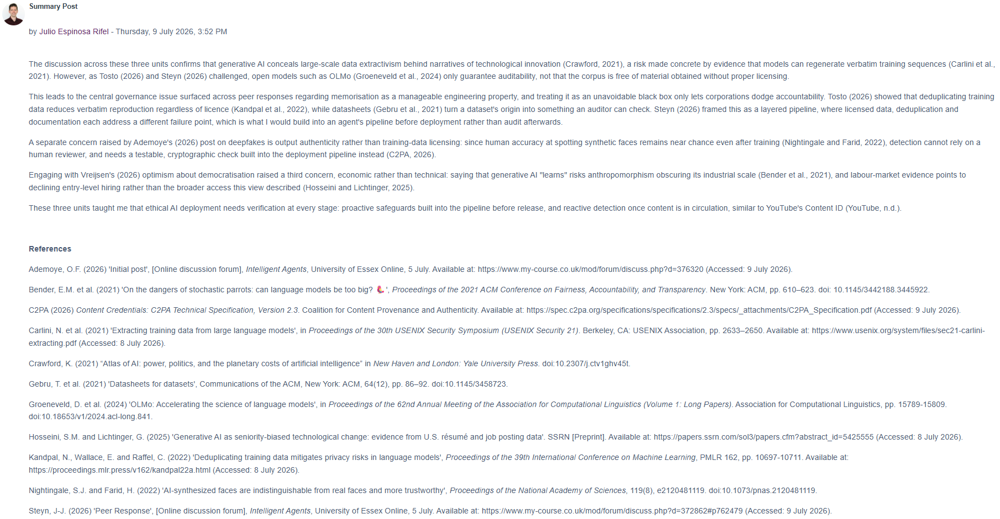

<a href="https://www.my-course.co.uk/mod/forum/discuss.php?d=377180">View Summary Post in forum</a>

---

### Appendix B: Deep Learning Forum Post

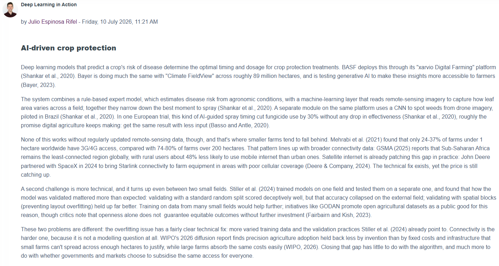

<a href="https://www.my-course.co.uk/mod/forum/discuss.php?d=377255">View post in forum</a>

